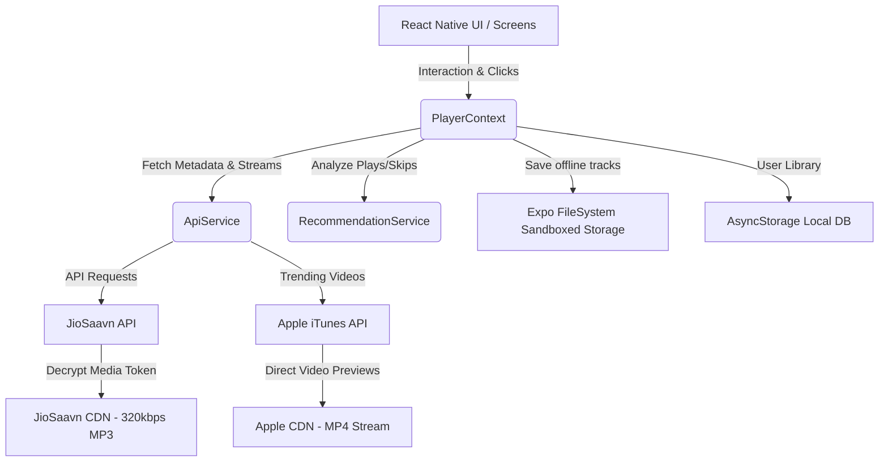

# 🎵 K-ECHO (NeonPulse) — Premium Music Streaming & Discovery Engine

[](https://expo.dev/)
[](https://reactnative.dev/)
[](https://opensource.org/licenses/MIT)
[](https://developer.android.com/)

**K-ECHO** (formerly *NeonPulse*) is a high-performance, client-side music application built using React Native and Expo. It delivers a premium, distraction-free streaming experience by fetching and playing high-fidelity tracks directly from secure CDNs, utilizing smart local recommendations, vertical video reels, and offline synchronization.

---

## ✨ Features

### 🎧 Core Audio Experience
* **High-Fidelity Streams**: Real-time decryption of JioSaavn encrypted media tokens into high-quality `320kbps` audio URLs.
* **Persistent Offline Downloads**: Sandboxed local track caching via `expo-file-system`. Fully accessible without internet connectivity.
* **Smart Queue & AI Radio**: Custom `RecommendationService` tracks user interactions (plays, skips, repeats) to dynamically adjust queue weights and auto-inject similar songs.
* **Synced Lyrics**: Autoscrolling lyrics sheet synchronized with current playback position.

### 📺 Visuals & Modern UI
* **Visual Reels Hub**: Full-screen vertical looping music video feed powered by `expo-av` and Apple iTunes Trending Music API.
* **Glassmorphic Theme**: Sleek dark mode visual identity with vibrant accents, custom gradients (`expo-linear-gradient`), and blur effects (`expo-blur`).
* **Micro-Animations & Haptics**: Rich user experience with smooth gestures, spring layouts, and tactile haptic feedback via `expo-haptics`.
* **Lock-Screen Controls**: Fully integrated notification controller and locking controls using `react-native-track-player`.

---

## 🏗️ Architecture & Flow

The application runs entirely on-device, bypassing any central servers. Local preferences are persisted in `AsyncStorage` while streaming content is resolved directly from public CDN nodes.



---

## 📂 Project Structure

```text
NeonPulse/
├── android/               # Native Android build configurations
├── assets/                # App icons, splash screens, and local media
├── src/
│   ├── components/        # Reusable UI widgets (NowPlayingBar, FullScreenPlayer)
│   ├── context/           # Global audio engine state manager (PlayerContext.js)
│   ├── data/              # Theme configurations, colors, and browse listings
│   ├── screens/           # Main application screens (Home, Search, Reels, Library)
│   └── services/          # API adapters, audio driver service, and local recommendation AI
├── App.js                 # App root & navigation router
├── index.js               # Application entry point
├── package.json           # Project dependencies & scripts
└── app.json               # Expo configuration manifest
```

---

## ⚡ Tech Stack

* **Framework**: [Expo SDK 54](https://expo.dev/) (React Native `0.81`)
* **Audio Engine**: [react-native-track-player](https://react-native-track-player.js.org/) (Native Audio Engine)
* **Video Player**: [expo-av](https://docs.expo.dev/versions/latest/sdk/av/)
* **Navigation**: [@react-navigation/native](https://reactnavigation.org/)
* **Security & Crypto**: [crypto-js](https://www.npmjs.com/package/crypto-js) (DES Decryption for streaming audio)
* **Local Database**: [@react-native-async-storage/async-storage](https://react-native-async-storage.github.io/async-storage/)

---

## 🚀 Getting Started

### 📋 Prerequisites
Ensure you have the following installed on your development machine:
* [Node.js](https://nodejs.org/) (v18+ recommended)
* [Expo CLI](https://docs.expo.dev/more/expo-cli/)
* Android Studio (for emulator testing) or Xcode (for iOS testing)

### ⚙️ Installation

1. **Clone the repository**:
   ```bash
   git clone https://github.com/Aryan005-haruki/K-ECHO-music-app.git
   cd K-ECHO-music-app
   ```

2. **Install dependencies**:
   ```bash
   npm install
   ```

3. **Run the development server**:
   ```bash
   npx expo start
   ```
   *Press `a` to launch the Android Emulator or scan the QR code to run on a physical device using the Expo Go app.*

---

## 🔒 Security & Privacy Posture

* **Sandboxed Storage**: Track downloads are saved inside the application's secure sandbox directory (`FileSystem.documentDirectory`). Other installed applications cannot access or alter these files.
* **No Telemetry / Tracker Free**: We do not collect, store, or transmit any user behavior data. All feedback data (skips, plays) stays on your device to optimize recommendations locally.
* **Encrypted in Transit**: All communications with JioSaavn, iTunes, and Deezer APIs are conducted over TLS (HTTPS).

---

## 📄 License

This project is licensed under the MIT License - see the [LICENSE](LICENSE) file for details.
